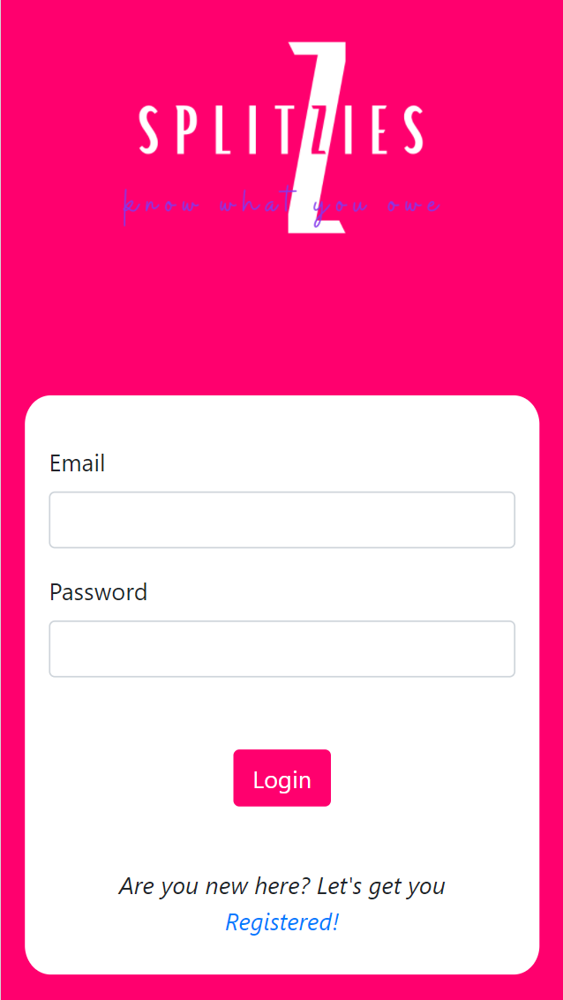
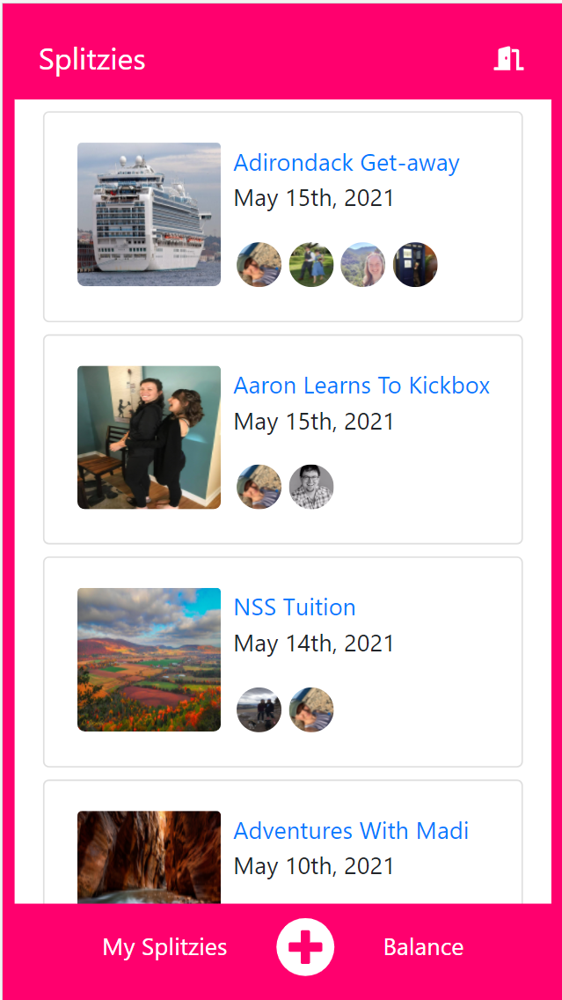

# Splitzies

Splitzies was created for those of us who like to do things with friends that cost
money! More specifically, it will calculate how much you owe, and who you owe it to
for any event or trip that you take with friends, where you have shared costs. 
Splitzies calucates the total cost for the Splitz, ie. the trip or event, how much
the logged in user owes in total, as well as how much they owe to each person who
participated.

## Table of Contents
* [Project Requirements and Features List](#project-requirements-and-features-list)
* [Technologies Used](#technologies-used)
* [Installing and Launching Splitzies](#instructions-for-installing-splitzies)
* [Appendix 1: Planning Documentation](#appendix-1-planning-documentation)
    * [Entity Relationship Diagrams](#entity-relationship-diagram)
    * [Wireframes](#wireframes)
 * [Appendix 2: Set Up Instructions](#appendix-2-set-up-instructions)
 
## Project Requirements and Features List

### Capstone Proposal 

<a href="https://docs.google.com/document/d/1xNc_EPJXexNj9wtw2TNjatTmBaHJCRshGoSl21IoWag/edit">Proposal</a>

###### Click picture to watch features

<a href=""></img></a>

### Get Started
When a user registers an account, or logs in from a previously registered
account, they are shown a list of all of their Splitz - ie. all of the events
or trips that they have participated in. 

<a href=""></img></a>

### Splitz Details
When the user has selected a splitz, they are taken to the details view of the splitz.
Here, they are given the image associated with the event, the title and date, people who 
are on the splitz, the option to edit or delete a splitz, the option to see all expenses 
or add an expense, the total cost of the splitz and total amount each person needs to contribute
and a list of how much is owed to each person by whom. 

<a href="https://youtu.be/zyerSAX9VIQ"></img></a>

### Add An Expense
### See all Expenses

<a href="https://youtu.be/wHq62cJCvT0"></img></a>

### Edit and Delete Splitz
Users are given the option to edit or delete the reviews that they have
written.

<a href="https://youtu.be/PRfWl9qae9Q"></img></a>

### Add A Splitz
### Balance

### What To Expect Next
Available in 2.0, will be the functionality to mark an expense owed as paid.

## Technologies Used

### Development Languages and Libraries


### Development Tools

    
 
  


## Instructions for Installing Find A Farmer
To launch the Simplified Supper app, you will need to have access to 
command line tools, node package manager, JSON Server. If you do not 
have access to any of these tools, you can find instructions for 
installing them in the Appendix.

Clone this repo on you personal machine using the following command
```sh
  git clone git@github.com:jessicadever1/findAFarmer.git
 ```
  
Install the NPM dependencies for this project using the following commands
```sh
  cd find-a-farmer
  npm install
 ```
 
From your terminal window, type
```sh
  npm start
```

Now that the server is up and running, you can open an internet browser 
and access the application
```sh
  http://localhost:8014/
```
### Congratulations you are now experiencing Find A Farmer!


## Appendix 1: Planning Documentation

  ### Entity Relationship Diagram
  

  ### Wireframes
  </img> 
  
  </img>
  

## Appendix 2: Set Up Instructions

  You will need to have command line tools installed for your computer 
  to use terminal commands.

  Linux/ Windows users, please visit the [Git page](https://git-scm.com/book/en/v2/Getting-Started-Installing-Git) and follow the instructions for set up

  Mac users follow the instructions below

  Open your terminal and type
  ```sh
    git --version
  ```

  You will now need to configure your git account. In the terminal window, type:
  ```sh
    git config -global user.name "Your Name"
    git config -global user.email "Your Email"
  ```

  If you do not have Node.js installed on your machine, visit the [Node.js Download Page](https://nodejs.org/en/download/) and  follow the instructions. To ensure that it is installed correctly, in your terminal window, type
  ```sh
    echo $PATH
  ```
  Ensure that the result has the following in the $PATH
  ```sh
    /usr/local/bin
    or
    /usr/local/bin:/usr/bin:/bin:/usr/sbin:/sbin
  ```

  Now you can follow the [installation instructions](#instructions-for-installing-Find-A-Farmer) 
  to get Find A Farmer up and running on your machine.

